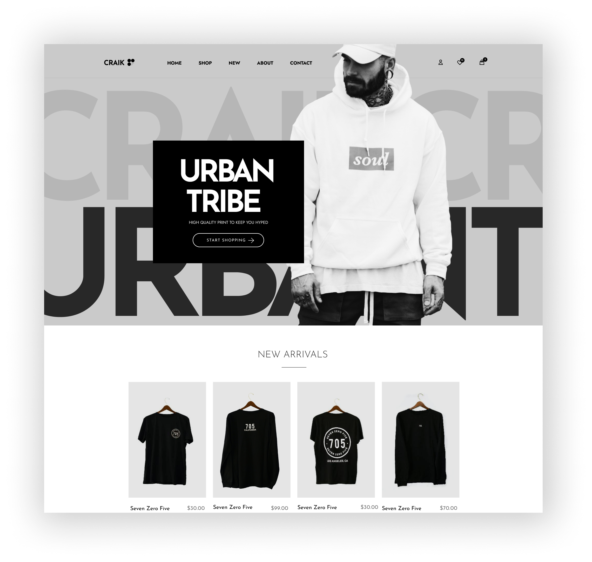

<!-- # Project Title -->
# Next Medusa Ecommerce App



<!-- ## Project Description -->
## Project Description

This is an ecommerce app built using Next.js 14 and Medusa.js.

<!-- ## Live Demo -->

<!-- ## Source Code -->

<!-- ## Article Link -->

## Getting Started

Clone the repo.
```bash
git clone https://github.com/Marktawa/medusa-next-shop.git
```
Change directory.
```bash
cd medusa-next-shop
```

## Author

[Mark Munyaka](https://markmunyaka.com)
- GitHub: [@Marktawa](https://github.com/Marktawa)
- Twitter: [@McMunyaka](https://twitter.com/McMunyaka)

## Sponsor

Support my passion for sharing development knowledge by making a donation to my [**Buy me a coffee**](https://www.buymeacoffee.com/markmunyaka) account. Your contribution helps me create valuable content and resources. Thank you for your support!

[](https://www.buymeacoffee.com/markmunyaka)

[Buy me a coffee](https://www.buymeacoffee.com/markmunyaka)
